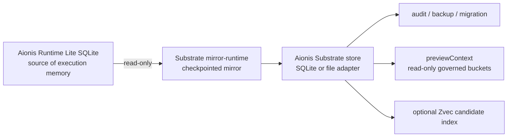

# Aionis Runtime Integration Design

Status: `0.1.9` integration boundary

This document defines how Aionis Substrate should be integrated with Aionis Runtime.

Aionis Substrate is the durable governed memory substrate that can sit beside Aionis Runtime to mirror, inspect, back up, migrate, and validate execution memory. Aionis Runtime remains the product runtime that observes runs, guides agents, attributes outcomes, and owns Agent-facing policy.

## Integration Principle

The first production integration is external and one-way:



Runtime writes execution memory. Substrate mirrors that evidence into an independent store. The bridge is checkpointed, idempotent, and source-immutable.

## Ownership Boundary

| Surface | Owned by Aionis Runtime | Owned by Aionis Substrate |
| --- | --- | --- |
| Agent loop | `observe`, `guide`, `feedback`, `measure` product loop | none |
| Runtime policy | Agent-facing guide behavior, richer admission policy, LLM/provider workflows | minimum storage-level admission contract only |
| Source writes | Runtime Lite SQLite, Runtime execution-memory contracts | external mirrored target stores |
| Evidence durability | writes original execution memory | append-only substrate event log, backup/restore, checkpoint compaction |
| Audit | emits Runtime traces and reports | decision receipts, relations, feedback records, immutable bridge reports |
| Search | Runtime product recall decisions | deterministic search plus optional candidate-index narrowing |
| Integration validation | Runtime behavior remains unchanged | source immutability, snapshot/live parity, checkpoint idempotency |

Substrate can support Runtime, but it must not silently become a second Runtime policy path.

## Supported Integration Modes

### 1. One-Shot Snapshot Import

Use this when a host needs to inspect or migrate an existing Runtime Lite SQLite database once.

```bash
npx @aionis/substrate@latest import-runtime-snapshot \
  --source /path/to/aionis-runtime-lite.sqlite \
  --target ./substrate.sqlite \
  --adapter sqlite \
  --scope repo-a
```

Contract:

- Runtime source is opened read-only.
- Substrate writes an independent target store.
- The command is allowed to create nodes, relations, feedback, and decision receipts in the target.
- The command is not allowed to mutate Runtime tables or Runtime source files.

### 2. Checkpointed Runtime Mirror

Use this when a host wants Substrate to keep a mirror of Runtime Lite evidence across repeated runs.

```bash
npx @aionis/substrate@latest mirror-runtime \
  --source /path/to/aionis-runtime-lite.sqlite \
  --target ./substrate.sqlite \
  --adapter sqlite \
  --checkpoint ./runtime-live-checkpoint.json \
  --scope repo-a
```

Contract:

- Runtime source is read-only.
- First pass writes mapped Runtime evidence into the Substrate target.
- Later passes skip unchanged evidence through checkpoint fingerprints.
- If the checkpoint is missing but the target already contains matching evidence, the sidecar repairs the checkpoint without duplicating events.
- If Runtime evidence changed, the sidecar writes the changed object.
- Corrupt or mismatched checkpoint state fails closed before target mutation.

### 3. Bounded Watch Mode

Use this when the host wants repeated polling in one supervised process.

```bash
npx @aionis/substrate@latest mirror-runtime \
  --source /path/to/aionis-runtime-lite.sqlite \
  --target ./substrate.sqlite \
  --adapter sqlite \
  --checkpoint ./runtime-live-checkpoint.json \
  --scope repo-a \
  --watch \
  --iterations 20 \
  --interval-ms 5000
```

Contract:

- The loop is bounded by `--iterations`.
- A single-instance lock prevents accidental concurrent mirrors.
- The host owns process supervision through cron, launchd, systemd, or its own agent process.

### 4. Read-Only Product Surfaces

After mirroring, product code can use Substrate for inspection and audit without changing Runtime behavior:

- `inspect` for store metadata.
- `preview-context` / `previewContext()` for read-only governed buckets.
- `backup` / `restore` for portable evidence.
- `searchNodes()` and optional Zvec candidate index for substrate-side discovery.

`compileContext()` records a decision receipt. Product UI or dry-run paths should prefer `previewContext()` unless they intentionally want an audit event.

## Deferred Integration Modes

These are allowed only after external sidecar evidence remains stable across real Runtime sources.

### External Dual-Write Experiment

Dual-write can be tested only as an isolated experiment:

- Runtime source code is unchanged.
- A wrapper or external host writes both Runtime and Substrate.
- Reports compare Runtime guide surfaces and Substrate preview surfaces.
- Failures remain evidence; they do not become Runtime policy changes.

### Runtime-Native Substrate Adapter

A native adapter can be considered only after:

- snapshot import parity is stable;
- Runtime mirror parity is stable;
- crash recovery and checkpoint idempotency are stable;
- product bridge gates show no Runtime behavior regression;
- the adapter can be disabled without changing Runtime guide behavior.

## Validation Gates

An integration change is acceptable only when these checks pass.

| Gate | Command | Meaning |
| --- | --- | --- |
| Local type and adapter checks | `npm run typecheck && npm test` | Store contracts and adapter parity hold. |
| Local evidence chain | `npm run check:runtime-local-evidence-chain` | Runtime mirror, checkpoint idempotency, backup verification, restore-plan, and restored context equivalence hold as one local chain. |
| Runtime mirror recovery | `npm run check:runtime-live-sidecar-recovery` | Checkpoint failure modes do not corrupt target state. |
| Runtime mirror soak | `npm run check:runtime-live-sidecar-soak` | Repeated evidence append and checkpoint skip behavior hold. |
| Published install smoke | `npm run check:registry-install && npm run check:published-runtime-smoke` | Registry package installs and imports Runtime fixtures. |
| Real Runtime bridge | `npm run check:published-runtime-bridge-corpus -- --root /path/to/runtime/.tmp --max-files N --live-passes M` | Published package bridges multiple real Runtime SQLite sources without source mutation or duplicate mirror events. |

The current published-package bridge evidence is recorded in [POST_RELEASE_EVIDENCE.md](POST_RELEASE_EVIDENCE.md).

## Current Evidence

Local evidence chain validation now covers the full local product path:

```bash
npm run check:runtime-local-evidence-chain
```

The gate verifies:

- Runtime SQLite is opened read-only;
- `mirror-runtime` writes only the isolated Substrate target and checkpoint;
- a second mirror pass is idempotent;
- backup verification succeeds;
- restore-plan remains read-only and restorable;
- restored Substrate context buckets match the mirrored context buckets.

It has also been run against a real focused Runtime Lite SQLite source under
`/Volumes/ziel/AionisRuntime-focused/.tmp/aionis-lite-write.sqlite` with:

- source unchanged;
- mirror idempotent;
- backup verified;
- restore-plan accepted;
- restored context equivalent to mirrored context.

`@aionis/substrate@0.1.7` passed a published-package Runtime bridge corpus soak against real focused Runtime SQLite files:

- 30 SQLite files discovered;
- 14 Runtime Lite SQLite files identified;
- 10 Runtime SQLite files attempted;
- 10 passed;
- 0 failed;
- 5922 nodes read;
- 5807 nodes imported;
- 33 relations imported;
- 5840 Substrate events written;
- 10 mirror passes per source;
- every pass after the first stayed idempotent for unchanged evidence.

This proves the published package can mirror real Runtime evidence into isolated Substrate stores. It does not claim downstream Agent task success and does not replace Runtime guide policy.

## Non-Goals

The Runtime integration must not introduce:

- Runtime source-code mutation for the external sidecar path;
- benchmark-specific bridge rules;
- Agent-host-specific architecture names in Substrate core;
- LLM/provider calls inside Substrate storage contracts;
- a second guide policy that competes with Runtime;
- silent promotion of Substrate preview output into Runtime authority.

## Next Integration Step

The next safe product step is an external Runtime integration package or host recipe:

1. install `@aionis/substrate`;
2. point `mirror-runtime` at Runtime Lite SQLite;
3. store the Substrate target beside Runtime data;
4. expose audit, backup, and preview surfaces to product UI;
5. keep Runtime guide behavior unchanged;
6. measure source immutability, idempotency, and preview parity.

Only after that path is stable should a Runtime-native adapter be considered.
